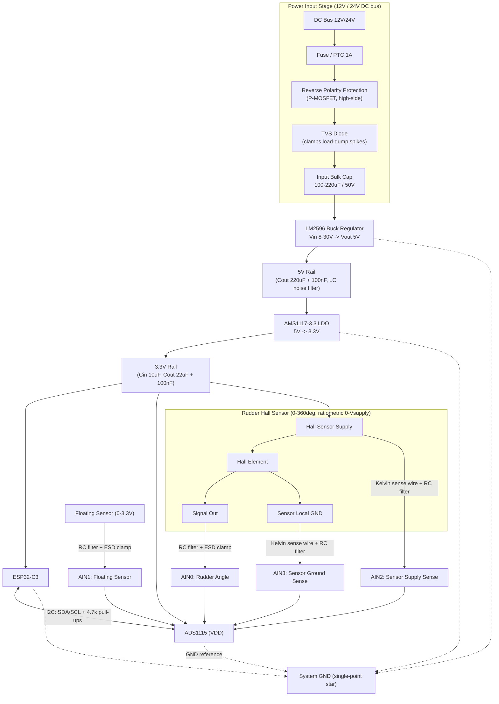

# Hardware Design — Rudder Angle Indicator

ESP32-C3 + ADS1115 + Hall-effect rudder angle sensor, powered from a 12V/24V DC marine bus.

## 1. Block diagram



## 2. Power input stage

Boat 12V/24V rails are electrically dirty: alternator load-dump transients, other loads switching on/off, and occasional reverse-connection mistakes. Protect before the regulator:

| Component | Purpose | Suggested part / value |
|---|---|---|
| Fuse / PTC resettable fuse | Over-current / short protection | 1 A fast-blow, or 0.5–1 A PTC |
| P-channel MOSFET (high-side) | Reverse-polarity protection, low loss | e.g. IRF9540 / SI2333 depending on current |
| TVS diode across input | Clamp load-dump / switching transients | SMBJ33A (24V systems) or SMBJ18A (12V systems) |
| Input bulk capacitor | Absorb ripple, supply buck's pulsed current | 100–220 µF electrolytic, ≥50V rating |

A series Schottky diode (e.g. SS34) is a simpler but lossier alternative to the P-MOSFET for reverse-polarity protection; at these currents the MOSFET is worth the extra part.

## 3. LM2596 buck stage (→ 5V intermediate rail)

Use the fixed **LM2596-5.0** (simpler, no feedback divider) rather than the adjustable version, since only one intermediate voltage is needed.

| Component | Value / notes |
|---|---|
| Input cap | 100 µF / 50V, low-ESR, close to Vin pin |
| Inductor | 33–68 µH (per LM2596 datasheet selection chart for Vin=12–24V, Vout=5V, ~1A load); use a shielded type to limit radiated EMI |
| Catch diode | Schottky, e.g. 1N5822 (3A/40V) |
| Output cap | 220 µF low-ESR electrolytic + 100 nF ceramic in parallel |
| Feedback (if using adjustable variant) | R1=1kΩ, R2 per datasheet formula for 5V, 1% tolerance |

This 5V rail feeds the AMS1117-3.3 and anything else that's happy at 5V (e.g. a 5V-tolerant display, if added later). Don't feed 24V directly into the AMS1117 — the drop across a linear regulator from 24V→3.3V would dissipate ~20V × Iload as heat, which is impractical; the buck stage must absorb the bulk of the drop first.

## 4. AMS1117-3.3 stage (→ clean 3.3V rail)

Cascading buck→LDO is deliberate, not redundant: the LM2596's switching ripple (tens of mV) would otherwise land directly on your 16-bit ADC's reference/supply. The LDO's high PSRR cleans that up before it reaches the ADS1115 and the sensor excitation.

| Component | Value / notes |
|---|---|
| Input cap | 10 µF tantalum/ceramic on the 5V side |
| Output cap | 22 µF tantalum (or 10 µF ceramic, X5R/X7R) + 100 nF ceramic close to pins — required for LDO stability |
| Bulk cap at ESP32-C3 3V3 pin | 100–220 µF low-ESR, **in addition** to the LDO's own output cap |

The extra bulk capacitor at the ESP32-C3 matters: Wi-Fi TX bursts pull 300–500 mA current spikes for tens of microseconds, faster than the LDO's transient response. Without local bulk capacitance this is a classic brownout/reset cause. Place it as close to the module's power pin as possible.

Thermal check: at ~0.4–0.5A total 3.3V load, the AMS1117 dissipates (5V−3.3V)×0.5A ≈ 0.85W. In a SOT-223 package this is manageable but give it copper pour for heatsinking; don't bury it under other components.

## 5. ADS1115 wiring

- VDD from the 3.3V rail (matches ESP32-C3 I/O voltage — no level shifting needed on I2C).
- I2C: SDA/SCL to ESP32-C3 GPIOs, 4.7kΩ pull-ups to 3.3V (only one set on the bus — most ADS1115 breakout boards already include them).
- ADDR pin tied to GND for default address 0x48.
- ALERT/RDY routed to a spare GPIO (recommended): lets firmware wait for conversion-ready via interrupt instead of polling/fixed delay, which matters since you're round-robining 4 channels.
- Decoupling: 0.1 µF ceramic directly at VDD pin.
- Gain/PGA: set FSR to ±4.096V (gain=1) for all four channels — comfortably covers the 0–3.3V range and gives ~125 µV/step (about 0.05° of angular resolution across 360°, more than adequate).
- Because the ADS1115 has one mux feeding a single ADC core, switching channels requires a settling delay — discard the first conversion after each mux change (firmware note, but budget the extra time in your sample-rate planning).

## 6. Per-channel analog front end

Every ADC input gets the same protection network — series resistor + shunt capacitor (anti-alias/noise filter) and a clamp to survive cable-induced transients (long runs through a metal hull pick up switching and ignition noise):

```
AINx ---[ R 4.7k-10k ]---+--- to ADS1115 pin
                          |
                        [ C 0.1-1uF ] to GND
                          |
                   [ dual diode clamp to 3.3V / GND ]
                   (e.g. BAT54S) — optional but recommended
```

Pick R/C for cutoff well below the ADS1115 conversion rate but well above the sensor's real bandwidth (a rudder moves slowly): e.g. R=10kΩ, C=1µF gives ~16 Hz cutoff — plenty of noise rejection with no meaningful lag.

- **AIN0 – Rudder angle**: Hall sensor signal output, ratiometric 0–3.3V.
- **AIN1 – Floating sensor**: same front-end; treat as a generic 0–3.3V analog input.
- **AIN2 – Sensor supply sense**: a dedicated wire back from the sensor's actual supply pin (Kelvin sense), *not* just tapped at the regulator. This is what lets you detect cable IR drop or connector resistance.
- **AIN3 – Sensor ground sense**: a dedicated wire back from the sensor's actual ground pin, referenced to the ADS1115's own GND. Any non-zero reading here is the IR drop / offset in the return conductor.

This requires a 5-conductor cable to the sensor (supply, ground, signal, +sense, −sense) rather than 3, if you want the sense readings to reflect what's happening at the sensor itself rather than just at the electronics enclosure. If a 5-wire run isn't practical, AIN2/AIN3 can instead just monitor the local 3.3V rail and local ground at the enclosure — still useful for catching regulator drift, but it won't correct for voltage dropped along the cable.

**Firmware implication (drives why 4 single-ended channels is the right hardware choice):** since all four channels share one ADS1115 GND, compute the sensor's true ratiometric position as:

```
angle_ratio = (AIN0_reading - AIN3_reading) / (AIN2_reading - AIN3_reading)
```

This cancels both regulator drift and cable/ground offset without needing true differential input pairs.

## 7. ESP32-C3

- If using a bare module (not a devkit): decouple VDD3P3 pins per Espressif's datasheet (10 µF bulk + 100 nF ceramic per pin), EN pin with 10kΩ pull-up to 3.3V and a 1 µF cap to GND for power-on reset delay, and pull up strapping pins (GPIO9 in particular) per your module's boot-mode requirements. Keep copper clear under/around the PCB antenna area.
- If using a devkit (e.g. ESP32-C3-DevKitM-1): feed the external 3.3V rail straight into the board's 3V3 pin, bypassing its onboard regulator — consistent with your plan of centralizing regulation on the AMS1117.
- Avoid GPIO9 (boot-mode strap) for I2C if your board's silkscreen doesn't already reserve alternate pins.

## 8. Grounding & layout notes

- Single-point ("star") ground: tie power-stage ground, digital ground, and ADC/analog ground together at one point near the ADS1115, rather than daisy-chaining ground copper through the buck converter.
- Keep the LM2596's switching loop (inductor–diode–input cap) physically tight and away from the ADS1115 and sensor wiring.
- Route the sensor cable as a twisted pair (signal+ground) with the sense wires twisted with their respective conductor; use overall shield grounded at the electronics end only (avoid ground loops).
- Add a 100Ω series resistor on I2C lines if traces/wires to the ADS1115 are long, to damp ringing.

## 9. Suggested schematic sheet organization (for KiCad/Eagle/Altium)

1. **Power** — input protection, LM2596 buck, AMS1117 LDO, both rails brought out as labeled nets (`+5V`, `+3V3`, `GND`).
2. **MCU** — ESP32-C3 with its decoupling/strapping, brought out as a labeled I2C bus (`SDA`, `SCL`) and GND.
3. **ADC & Sensor Interface** — ADS1115 plus the four per-channel RC/clamp networks, with connector footprints for the sensor cable (5-pin if using Kelvin sense) and the floating sensor.
4. **Connectors/Test points** — power input connector, sensor connector(s), and test points on `+5V`, `+3V3`, and each AINx for bring-up/debug.

Bringing each rail and bus out as a net label (rather than one flat sheet) keeps the schematic legible and matches how you'll actually probe the board during bring-up.
