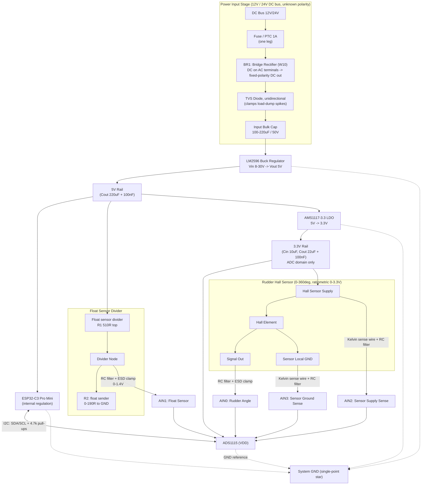

# Hardware Design — Rudder Angle Indicator

ESP32-C3 Pro Mini + ADS1115 + Hall-effect rudder angle sensor + resistive float sensor, powered from a 12V/24V DC marine bus.

**Revision note:** this revision splits the power architecture into two independent rails: **+5V runs the ESP32-C3 Pro Mini (which regulates itself internally) and biases the float sensor divider; +3.3V (from the AMS1117) is dedicated to the ADS1115 and the Hall sensor's ratiometric supply.** The two 3.3V-ish domains (the Pro Mini's own internal regulation and the external AMS1117 rail) are separate regulators tied only by common ground — see §7.

## 1. Block diagram



## 2. Power input stage

Boat 12V/24V rails are electrically dirty: alternator load-dump transients, other loads switching on/off, and occasional reverse-connection mistakes. This revision protects reverse polarity with a **full bridge rectifier (BR1)** wired across both input legs, rather than a series MOSFET.

| Component | Purpose | Suggested part / value |
|---|---|---|
| Fuse / PTC resettable fuse | Over-current / short protection | 1 A fast-blow, or 0.5–1 A PTC, in series with one input leg |
| Bridge rectifier (BR1) | Polarity-agnostic input — output is always correct polarity | W10 (1.5A / 1000V DIP) |
| TVS diode (unidirectional) | Clamp load-dump / switching transients | SMBJ33A (24V systems) or SMBJ18A (12V systems), after BR1 |
| Input bulk capacitor | Absorb ripple, supply buck's pulsed current | 100–220 µF electrolytic, ≥50V rating |

**Why a bridge instead of a MOSFET.** Feeding an unknown-polarity DC source into a bridge rectifier's two AC terminals is a standard trick: whichever leg is actually positive, two of the four diodes conduct and the DC output on the +/− terminals is always correct polarity. Compared to the earlier series P-MOSFET approach:

- **It keeps working when reversed**, not just protected. The MOSFET approach blocks current entirely on a reversed connection (safe, but the board doesn't power up). The bridge continues to deliver power regardless of which way J1 is wired — worth deciding whether that's actually what you want for a helm instrument (staying alive through a wiring mistake) versus a hard, obvious fail (nothing lights up until the wiring is fixed).
- **The cost is a voltage drop, not complexity.** Two diodes conduct in series at any moment, so BR1 drops roughly 2×V<sub>f</sub> ≈ 1.4–2V continuously (standard silicon). On a 24V system this is a rounding error. On a 12V system, check it against engine-cranking sag — the LM2596 still regulates comfortably down to a few volts above 5V, so there's margin, just less of it than with the MOSFET's near-zero drop.
- **Thermal.** At an estimated few hundred mA total system draw, a W10 DIP runs cool with no heatsink. If real current draw creeps toward 1A continuous, a Schottky bridge (e.g. a GBU-series part) roughly halves the voltage drop and dissipation of a standard silicon bridge like the W10.
- **Simpler to build.** One 4-pin part, no gate-bias resistor or reverse-connection failure mode to reason through — the old Q1/R1 pair is removed entirely.

**Ordering:** Fuse → BR1 → TVS → bulk cap → LM2596. The fuse only needs to be in series with one input leg (it still protects the loop regardless of which physical wire ends up carrying current). Placing the TVS *after* BR1 means it only ever needs to be unidirectional, since polarity is already fixed by that point — putting it before the bridge would mean protecting an unknown-polarity node, which needs a bidirectional TVS instead.

## 3. LM2596 buck stage (→ 5V intermediate rail)

Use the fixed **LM2596-5.0** (simpler, no feedback divider) rather than the adjustable version, since only one intermediate voltage is needed.

| Component | Value / notes |
|---|---|
| Input cap | 100 µF / 50V, low-ESR, close to Vin pin |
| Inductor | 33–68 µH (per LM2596 datasheet selection chart for Vin=12–24V, Vout=5V, ~1A load); use a shielded type to limit radiated EMI |
| Catch diode | Schottky, e.g. 1N5822 (3A/40V) |
| Output cap | 220 µF low-ESR electrolytic + 100 nF ceramic in parallel |
| Feedback (if using adjustable variant) | R1=1kΩ, R2 per datasheet formula for 5V, 1% tolerance |

This 5V rail now has three loads: the AMS1117-3.3 (for the ADC domain), the ESP32-C3 Pro Mini's own onboard regulator, and the top of the float-sensor divider (§6a). Don't feed 24V directly into the AMS1117 — the drop across a linear regulator from 24V→3.3V would dissipate ~20V × Iload as heat, which is impractical; the buck stage must absorb the bulk of the drop first.

Give L1/C2 enough margin for the combined load: ESP32-C3 Wi-Fi TX peaks (~400–500 mA), the AMS1117's input current, and the float sensor's divider current (≤10 mA) all draw from this one 5V rail.

## 4. AMS1117-3.3 stage (→ clean 3.3V rail, ADC domain only)

Cascading buck→LDO is deliberate, not redundant: the LM2596's switching ripple (tens of mV) would otherwise land directly on your 16-bit ADC's reference/supply. The LDO's high PSRR cleans that up before it reaches the ADS1115 and the Hall sensor's excitation.

This 3.3V rail is now dedicated to the ADC side of the board — it powers **only** the ADS1115 and the Hall sensor's supply (which sets the sensor's 0–3.3V ratiometric range). The ESP32-C3 Pro Mini does **not** draw from this rail; it regulates its own 3.3V internally from the 5V rail (§7). This keeps the ADC's supply light, quiet, and isolated from the MCU's Wi-Fi current transients.

| Component | Value / notes |
|---|---|
| Input cap | 10 µF tantalum/ceramic on the 5V side |
| Output cap | 22 µF tantalum (or 10 µF ceramic, X5R/X7R) + 100 nF ceramic close to pins — required for LDO stability |

Thermal check: at this rail's much lighter load now (ADS1115 ~150 µA + Hall sensor excitation current, typically well under 50 mA total), the AMS1117 runs cool — no heatsinking concerns.

## 5. ADS1115 wiring

- VDD from the dedicated 3.3V rail (AMS1117 output, ADC domain).
- I2C: SDA/SCL to ESP32-C3 Pro Mini GPIOs, 4.7kΩ pull-ups to the ADS1115's 3.3V rail (only one set on the bus — most ADS1115 breakout boards already include them). See §7 for why pull-ups reference this rail specifically, given the Pro Mini has its own separate 3.3V.
- ADDR pin tied to GND for default address 0x48.
- ALERT/RDY routed to a spare GPIO (recommended): lets firmware wait for conversion-ready via interrupt instead of polling/fixed delay, which matters since you're round-robining 4 channels.
- Decoupling: 0.1 µF ceramic directly at VDD pin.
- Gain/PGA: set FSR to ±4.096V (gain=1) for all four channels — comfortably covers the 0–3.3V range and gives ~125 µV/step (about 0.05° of angular resolution across 360°, more than adequate).
- Because the ADS1115 has one mux feeding a single ADC core, switching channels requires a settling delay — discard the first conversion after each mux change (firmware note, but budget the extra time in your sample-rate planning).

## 6. Per-channel analog front end

Every ADC input gets the same protection network — series resistor + shunt capacitor (anti-alias/noise filter) and a clamp to survive cable-induced transients (long runs through a metal hull pick up switching and ignition noise):

```
AINx ---[ R 4.7k-10k ]---+--- to ADS1115 pin
                          |
                        [ C 0.1-1uF ] to GND
                          |
                   [ dual diode clamp to 3.3V / GND ]
                   (e.g. BAT54S) — optional but recommended
```

Pick R/C for cutoff well below the ADS1115 conversion rate but well above the sensor's real bandwidth (a rudder moves slowly): e.g. R=10kΩ, C=1µF gives ~16 Hz cutoff — plenty of noise rejection with no meaningful lag.

- **AIN0 – Rudder angle**: Hall sensor signal output, ratiometric 0–3.3V, supplied from the AMS1117 3.3V rail.
- **AIN1 – Float sensor**: see §6a — a resistive divider output, 0–1.4V, biased from the **5V** rail (not 3.3V).
- **AIN2 – Sensor supply sense**: a dedicated wire back from the Hall sensor's actual supply pin (Kelvin sense), *not* just tapped at the regulator. This is what lets you detect cable IR drop or connector resistance.
- **AIN3 – Sensor ground sense**: a dedicated wire back from the Hall sensor's actual ground pin, referenced to the ADS1115's own GND. Any non-zero reading here is the IR drop / offset in the return conductor.

This requires a 5-conductor cable to the Hall sensor (supply, ground, signal, +sense, −sense) rather than 3, if you want the sense readings to reflect what's happening at the sensor itself rather than just at the electronics enclosure. If a 5-wire run isn't practical, AIN2/AIN3 can instead just monitor the local 3.3V rail and local ground at the enclosure — still useful for catching regulator drift, but it won't correct for voltage dropped along the cable.

**Firmware implication (drives why 4 single-ended channels is the right hardware choice):** since all four channels share one ADS1115 GND, compute the sensor's true ratiometric position as:

```
angle_ratio = (AIN0_reading - AIN3_reading) / (AIN2_reading - AIN3_reading)
```

This cancels both regulator drift and cable/ground offset without needing true differential input pairs.

## 6a. AIN1 — float sensor divider (and why no op-amp is needed)

The float sender is a variable resistor, 0–190Ω across its travel (standard European/VDO-style sender curve — confirm against your specific sender's datasheet, since some run 0–90Ω or reversed). Bias it from **5V**, not 3.3V, with a fixed top resistor:

```
+5V ---[ R1 510R ]---+--- to AIN1 (through the standard RC filter + clamp)
                      |
                    [ R2: float sender, 0-190R ] 
                      |
                     GND
```

- At R2 = 0Ω (empty/full end of travel): Vout = 0V.
- At R2 = 190Ω (opposite end of travel): Vout = 5V × 190/(510+190) ≈ **1.36V**.

That ~1.4V max lands comfortably inside the ADS1115's absolute input range even though the ADC itself runs on the separate 3.3V rail (max allowed input ≈ VDD + 0.3V ≈ 3.6V) — there's no scaling hazard here.

**Do you need an op-amp?** No. The divider's Thevenin source impedance tops out around R1∥R2 ≈ 138Ω (at R2 = 190Ω) — trivially low next to the ADS1115's recommended source impedance, and the anti-alias resistor you're already adding (R 4.7–10kΩ) dominates the total source impedance anyway. A unity-gain op-amp buffer would add a component, a supply rail for the op-amp itself, and another failure point without fixing anything real here.

What *is* worth doing instead of adding hardware: since the float signal only reaches ~1.4V while AIN0 uses the full ±4.096V ADS1115 range, set a **higher PGA gain specifically for the AIN1 conversion** (e.g. ±2.048V, gain=2) — the ADS1115 lets you change gain per conversion since channels are read one at a time through its single mux. That alone roughly doubles your effective resolution on this channel for free.

The only case where a buffer earns its keep: if the float sender cable run is long and picks up noise before reaching the board. If so, add an optional single op-amp voltage follower (e.g. MCP6001, powered from the 3.3V ADC rail with its output clamped by the existing protection diodes) between the divider node and the RC filter — worth keeping as an unpopulated footprint if you're unsure yet, rather than committing to it now.

## 7. ESP32-C3 Pro Mini

The Pro Mini form-factor board carries its own onboard regulator, so it's wired far more simply than a bare module:

- Feed the board's **5V/VIN pin directly from the LM2596's 5V rail** — do not route the AMS1117's 3.3V to it. Its onboard regulator handles 5V→3.3V internally for the chip.
- A modest bulk cap (47–100 µF) at the Pro Mini's 5V input is cheap insurance against wiring inductance and the board's own Wi-Fi TX current transients, even though it has on-board decoupling already.
- Its 3V3 pin (if broken out) is that onboard regulator's *output* — usable for a small extra peripheral if needed, but not a substitute for the dedicated AMS1117 rail powering the ADS1115.

**Two independent 3.3V domains.** The Pro Mini's internal 3.3V (from its own onboard LDO) and the AMS1117's 3.3V (feeding the ADS1115) are two separately regulated rails that happen to be the same nominal voltage — they are **not** the same net, and should not be tied together. What ties the two boards together electrically is a common **GND** (star-grounded, §8) and the I2C bus. Reference the I2C pull-ups (4.7kΩ) to the **ADS1115's** 3.3V rail, not the Pro Mini's — the Pro Mini's GPIOs read/drive against its own internal ~3.3V logic levels, which are close enough to the ADS1115's independently-regulated 3.3V for standard I2C to work correctly across the two domains, as long as ground is common.
- Avoid GPIO9 (boot-mode strap) for I2C if your board's silkscreen doesn't already reserve alternate pins.

## 8. Grounding & layout notes

- Single-point ("star") ground: tie power-stage ground, digital ground, and ADC/analog ground together at one point near the ADS1115, rather than daisy-chaining ground copper through the buck converter.
- Keep the LM2596's switching loop (inductor–diode–input cap) physically tight and away from the ADS1115 and sensor wiring.
- Route the sensor cable as a twisted pair (signal+ground) with the sense wires twisted with their respective conductor; use overall shield grounded at the electronics end only (avoid ground loops).
- Add a 100Ω series resistor on I2C lines if traces/wires to the ADS1115 are long, to damp ringing.

## 9. Suggested schematic sheet organization (for KiCad/Eagle/Altium)

1. **Power** — input protection, LM2596 buck, AMS1117 LDO, both rails brought out as labeled nets (`+5V`, `+3V3`, `GND`).
2. **MCU** — ESP32-C3 Pro Mini on the `+5V` rail (its own regulation, no external decoupling network needed), brought out as a labeled I2C bus (`SDA`, `SCL`) and GND.
3. **ADC & Sensor Interface** — ADS1115 on the `+3V3` rail plus the four per-channel RC/clamp networks (including the AIN1 float-sensor divider fed from `+5V`), with connector footprints for the Hall sensor cable (5-pin, Kelvin sense) and the float sensor.
4. **Connectors/Test points** — power input connector, sensor connector(s), and test points on `+5V`, `+3V3`, and each AINx for bring-up/debug.

Bringing each rail and bus out as a net label (rather than one flat sheet) keeps the schematic legible and matches how you'll actually probe the board during bring-up.
